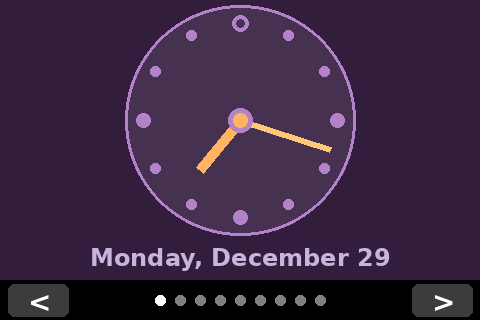

# Solar Smart Clock

A Raspberry Pi-powered smart clock displaying real-time solar data, weather, moon phases, and time on a Waveshare 3.5" TFT LCD touchscreen.


[](https://github.com/bigguy6883/Solar-Smart-Clock/actions/workflows/test.yml)
[](https://codecov.io/gh/bigguy6883/Solar-Smart-Clock)

## Screenshots

| Clock | Weather | Air Quality |
|:---:|:---:|:---:|
|  |  |  |

| Sun Path | Day Length | Solar Details |
|:---:|:---:|:---:|
|  |  |  |

| Moon Phase | Analemma | Analog Clock |
|:---:|:---:|:---:|
|  |  |  |

## Features

### Multi-View Interface
Navigate between nine views using touchscreen swipes or the < > buttons:

1. **Clock** - Digital time with weather summary and sun times
2. **Weather** - Current conditions and 3-day forecast
3. **Air Quality** - US EPA AQI with pollutant breakdown
4. **Sun Path** - Sun trajectory chart with next event countdown
5. **Day Length** - Yearly day length curve with solstice/equinox markers
6. **Solar Details** - Comprehensive sun times and golden hour
7. **Moon Phase** - Lunar cycle visualization
8. **Analemma** - Figure-8 sun position diagram
9. **Analog Clock** - Traditional clock face with dynamic theme

### Additional Features
- Touch navigation (swipe left/right, tap buttons)
- HTTP API for remote screenshots and navigation
- Auto-start via systemd service
- Configurable location, timezone, and settings

## Quick Start

### 1. Clone Repository
```bash
cd ~
git clone https://github.com/bigguy6883/Solar-Smart-Clock.git solar-clock
cd solar-clock
```

### 2. Install Dependencies
```bash
sudo apt-get update
sudo apt-get install -y python3-pip python3-pil python3-requests
pip3 install --break-system-packages astral ephem
```

### 3. Configure
```bash
# Copy example config
cp config.example.json config.json

# Edit with your location
nano config.json
```

Set your location in `config.json`:
```json
{
  "location": {
    "name": "Your City",
    "region": "State, Country",
    "timezone": "America/New_York",
    "latitude": 40.7128,
    "longitude": -74.0060
  }
}
```

### 4. Set Up API Key
Get a free API key from [OpenWeatherMap](https://openweathermap.org/api), then:
```bash
sudo mkdir -p /etc/solar-clock
sudo nano /etc/solar-clock/secrets
```

Add your API key:
```
OPENWEATHER_API_KEY=your_api_key_here
```

Secure the file:
```bash
sudo chmod 600 /etc/solar-clock/secrets
```

### 5. Run
```bash
python3 -m solar_clock
```

### 6. Install as Service (Optional)
```bash
sudo cp solar-clock.service /etc/systemd/system/
sudo systemctl daemon-reload
sudo systemctl enable solar-clock
sudo systemctl start solar-clock
```

## Configuration Reference

### config.json

| Section | Setting | Default | Description |
|---------|---------|---------|-------------|
| `location.name` | string | "Unknown" | City name displayed on views |
| `location.timezone` | string | "UTC" | Timezone for calculations |
| `location.latitude` | float | 0.0 | Latitude (-90 to 90) |
| `location.longitude` | float | 0.0 | Longitude (-180 to 180) |
| `display.width` | int | 480 | Display width in pixels |
| `display.height` | int | 320 | Display height in pixels |
| `display.framebuffer` | string | "/dev/fb1" | Framebuffer device |
| `http_server.enabled` | bool | true | Enable HTTP API |
| `http_server.port` | int | 8080 | HTTP server port |
| `http_server.bind_address` | string | "127.0.0.1" | Bind address (localhost only by default) |
| `weather.update_interval_seconds` | int | 900 | Weather refresh interval |
| `weather.units` | string | "imperial" | Temperature units (imperial/metric) |

### Environment Variables

| Variable | Description |
|----------|-------------|
| `OPENWEATHER_API_KEY` | OpenWeatherMap API key (required for weather) |
| `HTTP_AUTH_USER` | HTTP Basic Auth username (optional) |
| `HTTP_AUTH_PASS` | HTTP Basic Auth password (optional) |

## HTTP API

The clock runs an HTTP server for remote control and screenshots.

| Endpoint | Description |
|----------|-------------|
| `GET /screenshot` | Capture current display as PNG |
| `GET /next` | Navigate to next view |
| `GET /prev` | Navigate to previous view |
| `GET /view` | Get current view name and index |
| `GET /health` | Health check (returns "OK") |

**Note**: By default, the HTTP server only accepts connections from localhost. Use `--bind-all` flag or set `http_server.bind_address` to `"0.0.0.0"` for network access.

### Examples
```bash
# Screenshot (from same machine)
curl -o screen.png http://localhost:8080/screenshot

# Screenshot (from network, if enabled)
curl -o screen.png http://clock.local:8080/screenshot

# Navigate
curl http://localhost:8080/next
curl http://localhost:8080/view
```

## Hardware Requirements

| Component | Details |
|-----------|---------|
| Raspberry Pi | Pi Zero W, Pi 3, Pi 4, or Pi 5 |
| Display | Waveshare 3.5" RPi LCD (A) / Spotpear 3.5" LCD |
| Display Controller | ILI9486 (SPI) |
| Touch Controller | ADS7846 (SPI) |
| Network | WiFi (for weather/AQI data) |

## Display Setup

### 1. Install Overlay
```bash
git clone https://github.com/waveshare/LCD-show.git ~/LCD-show
sudo cp ~/LCD-show/waveshare35a-overlay.dtb /boot/firmware/overlays/waveshare35a.dtbo
```

### 2. Configure Boot
Edit `/boot/firmware/config.txt`:
```
#dtoverlay=vc4-kms-v3d
dtparam=spi=on
dtoverlay=waveshare35a:rotate=90
hdmi_force_hotplug=1
hdmi_cvt=480 320 60 6 0 0 0
hdmi_group=2
hdmi_mode=87
```

### 3. Reboot
```bash
sudo reboot
```

## Project Structure

```
solar-clock/
├── solar_clock/
│   ├── __init__.py
│   ├── main.py              # Entry point
│   ├── config.py            # Configuration loading
│   ├── display.py           # Framebuffer handling
│   ├── http_server.py       # HTTP API server
│   ├── touch_handler.py     # Touch input
│   ├── data/
│   │   ├── weather.py       # OpenWeatherMap provider
│   │   ├── solar.py         # Sun calculations (astral)
│   │   └── lunar.py         # Moon calculations (ephem)
│   └── views/
│       ├── base.py          # Base view class
│       ├── clock.py         # Clock view
│       ├── weather.py       # Weather view
│       └── ...              # Other views
├── tests/                   # Unit tests
├── config.example.json      # Configuration template
├── requirements.txt         # Dependencies
└── README.md
```

## Service Management

```bash
# Check status
sudo systemctl status solar-clock

# View logs
journalctl -u solar-clock -f

# Restart after code changes
sudo systemctl restart solar-clock

# Stop
sudo systemctl stop solar-clock
```

## Development

### Install Dev Dependencies
```bash
pip3 install -r requirements-dev.txt
```

### Run Tests
```bash
pytest
pytest --cov=solar_clock  # With coverage
```

### Code Style
```bash
black solar_clock tests
flake8 solar_clock tests
mypy solar_clock
```

## Troubleshooting

### Display not working
- Check `/dev/fb1` exists: `ls -la /dev/fb*`
- Verify overlay in boot config
- Check SPI enabled: `ls /dev/spi*`

### Touch not responding
- Check `/dev/input/event0` exists
- Verify touch overlay loaded: `dmesg | grep touch`
- Run as root or add user to `input` group

### Weather not updating
- Verify API key is set: `echo $OPENWEATHER_API_KEY`
- Check network connectivity
- View logs: `journalctl -u solar-clock | grep -i weather`

### HTTP server not accessible
- Default binds to localhost only
- Use `--bind-all` for network access
- Check firewall settings

## Security Considerations

- **API Key**: Stored in `/etc/solar-clock/secrets` with restricted permissions
- **HTTP Server**: Binds to localhost by default; enable network access explicitly
- **Service**: Runs with reduced privileges (`NoNewPrivileges`, `ProtectSystem`)

## License

MIT License - Feel free to modify and distribute.

## Credits

- Solar calculations: [Astral](https://github.com/sffjunkie/astral)
- Lunar calculations: [PyEphem](https://rhodesmill.org/pyephem/)
- Weather data: [OpenWeatherMap](https://openweathermap.org/)
- Display drivers: [Waveshare LCD-show](https://github.com/waveshare/LCD-show)
- Code improvements: [Claude Code](https://claude.ai/code)
