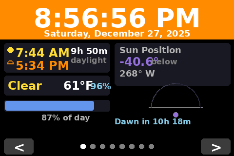
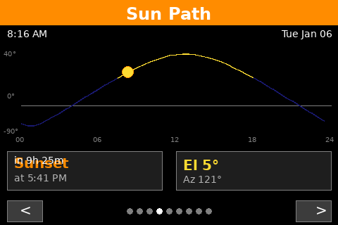
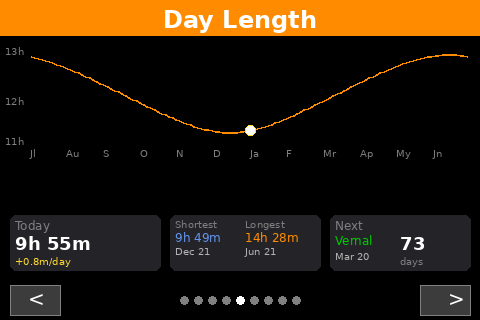
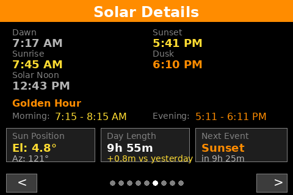
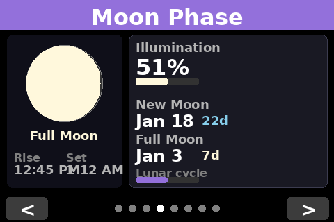
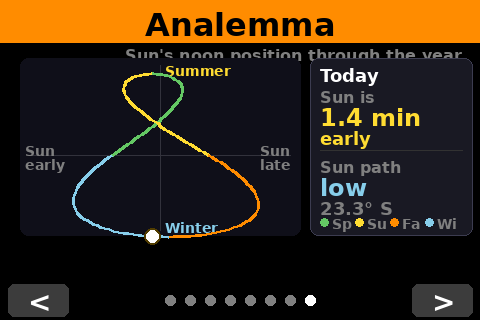

# Solar Smart Clock

A Raspberry Pi-powered smart clock displaying real-time solar data, weather, moon phases, and time on a Waveshare 3.5" TFT LCD touchscreen.


## Overview

This project was adapted from the original [Solar-Smart-Clock](https://github.com/bigguy6883/Solar-Smart-Clock) Arduino/Pico W project to run on a Raspberry Pi Zero W with a Waveshare 3.5" SPI LCD display. The application renders directly to the Linux framebuffer, providing a lightweight solution without requiring a full desktop environment.

## Screenshots

| Clock | Weather | Air Quality |
|:---:|:---:|:---:|
|  |  |  |

| Sun Path | Day Length | Solar Details |
|:---:|:---:|:---:|
|  |  |  |

| Moon Phase | Analemma |
|:---:|:---:|
|  |  |

## Features

### Multi-View Interface
Navigate between eight views using the **< >** buttons at the bottom of the screen, or swipe left/right on the touchscreen. Views are grouped logically: time/weather, solar information, then celestial.

5. **Day Length View**
   - Year-long day length curve chart
   - Solstice/equinox vertical markers with seasonal colors
   - Today's position highlighted on curve
   - **Today box**: Current day length with daily trend (+/- minutes)
   - **Min/Max box**: Shortest and longest days with dates
   - **Next event box**: Countdown to next solstice/equinox

7. **Moon Phase View**
   - Visual moon phase display with illumination
   - Phase name (New, Waxing Crescent, Full, etc.)
   - Illumination percentage with progress bar
   - Moonrise and moonset times
   - Days until next new moon
   - Days until next full moon
   - Lunar cycle progress bar
### Additional Features
- **Navigation Buttons**: Tap < or > buttons at bottom to change views
- **Touch Navigation**: Swipe left/right to change views
- **Page Indicator**: 8 dots at bottom show current view position
- **Dynamic Themes**: Header colors change based on time of day
- **Auto-start**: Runs automatically on boot via systemd service
- **Landscape Display**: Optimized 480x320 landscape layout

## Hardware Requirements

| Component | Details |
|-----------|---------|
| Raspberry Pi | Pi Zero W, Pi 3, Pi 4, or Pi 5 |
| Display | Waveshare 3.5" RPi LCD (A) Rev 2.0 / Spotpear 3.5" LCD |
| Display Controller | ILI9486 (SPI) |
| Touch Controller | ADS7846 (SPI) |
| Storage | MicroSD card (8GB+) |
| Network | WiFi connection (for weather/AQI data) |

## Software Requirements

- Raspberry Pi OS (Bookworm/Trixie - Debian 12/13)
- Python 3.x
- Required packages:
  - python3-pil - Image processing
  - python3-requests - API calls
  - astral - Sunrise/sunset calculations
  - ephem - Moon phase, solstice/equinox, and analemma calculations
  - evdev - Touch screen input handling

## Installation

### 1. Prepare the Display

Clone the Waveshare LCD driver repository:
```bash
cd ~
git clone https://github.com/waveshare/LCD-show.git
```

Copy the display overlay:
```bash
sudo cp ~/LCD-show/waveshare35a-overlay.dtb /boot/firmware/overlays/waveshare35a.dtbo
```

### 2. Configure Boot Settings

Edit `/boot/firmware/config.txt`:
```bash
sudo nano /boot/firmware/config.txt
```

Comment out the KMS driver (if present):
```
#dtoverlay=vc4-kms-v3d
```

Add these lines at the end:
```
# Waveshare 3.5" LCD settings
dtparam=spi=on
dtoverlay=waveshare35a:rotate=90
hdmi_force_hotplug=1
hdmi_cvt=480 320 60 6 0 0 0
hdmi_group=2
hdmi_mode=87
display_rotate=0
```

Reboot to apply changes:
```bash
sudo reboot
```

### 3. Install Dependencies

```bash
sudo apt-get update
sudo apt-get install -y python3-pip python3-pil python3-requests python3-numpy python3-evdev

pip3 install --break-system-packages astral ephem
```

### 4. Install Solar Clock

```bash
cd ~
git clone https://github.com/bigguy6883/Solar-Smart-Clock.git solar-clock
cd solar-clock
```

### 5. Configure Location and API Key

Edit `clock.py` and update the LOCATION settings for your area:
```python
LOCATION = LocationInfo(
    name="Your City",
    region="State, Country",
    timezone="America/New_York",  # Your timezone
    latitude=34.6948,              # Your latitude
    longitude=-84.4822             # Your longitude
)
```

Get a free API key from [OpenWeatherMap](https://openweathermap.org/api) and update:
```python
OPENWEATHER_API_KEY = "your_api_key_here"
```

> **Note:** The free tier includes current weather, 5-day forecast, and air quality data.

### 6. Install Systemd Service

```bash
sudo cp solar-clock.service /etc/systemd/system/
sudo systemctl daemon-reload
sudo systemctl enable solar-clock
sudo systemctl start solar-clock
```

## Usage

### Navigation
- **Tap < button**: Previous view
- **Tap > button**: Next view
- **Swipe Left**: Next view
- **Swipe Right**: Previous view

### Views
| # | View | Description |
|---|------|-------------|
| 1 | Clock | Main time display with weather and sun info |
| 2 | Weather | Current conditions and 3-day forecast |
| 3 | Air Quality | AQI and pollutant levels |
| 4 | Sun Path | Sun trajectory with next event countdown |
| 5 | Day Length | Yearly chart with solstice/equinox info |
| 6 | Solar | Detailed sun times and golden hours |
| 7 | Moon | Phase visualization and upcoming dates |
| 8 | Analemma | Figure-8 sun position chart |

## Service Management

```bash
# Check status
sudo systemctl status solar-clock

# Start/stop/restart
sudo systemctl start solar-clock
sudo systemctl stop solar-clock
sudo systemctl restart solar-clock

# View live logs
journalctl -u solar-clock -f
```

## File Structure

```
~/solar-clock/
├── clock.py              # Main application
├── solar-clock.service   # Systemd service file
├── screenshots/          # View screenshots
└── README.md             # This file
```

## Technical Details

### Architecture
- **ViewManager**: Handles navigation between the 8 views
- **TouchHandler**: Threaded touch input processor using evdev
- **SolarClock**: Main class rendering frames to framebuffer

### Framebuffer Writing
The application writes directly to `/dev/fb1` using RGB565 format:
```python
rgb565 = ((r >> 3) << 11) | ((g >> 2) << 5) | (b >> 3)
```

### External APIs
| API | Used For | Update Interval |
|-----|----------|-----------------|
| OpenWeatherMap Current | Temperature, conditions, wind | 15 minutes |
| OpenWeatherMap Forecast | 3-day forecast | 15 minutes |
| OpenWeatherMap Air Pollution | AQI and pollutants | 30 minutes |

### Local Calculations
| Library | Used For |
|---------|----------|
| astral | Sunrise, sunset, dawn, dusk, golden hour, solar position |
| ephem | Moon phase, solstice/equinox dates, analemma |

## License

MIT License - Feel free to modify and distribute.

## Credits

- Code improvements: [Claude Code](https://claude.com/claude-code)
- Original Arduino/Pico W version: [Solar-Smart-Clock](https://github.com/bigguy6883/Solar-Smart-Clock)

- Solar calculations: [Astral](https://github.com/sffjunkie/astral)
- Moon & astronomical calculations: [PyEphem](https://rhodesmill.org/pyephem/)
- Weather & Air Quality data: [OpenWeatherMap](https://openweathermap.org/)
- Display drivers: [Waveshare LCD-show](https://github.com/waveshare/LCD-show)
